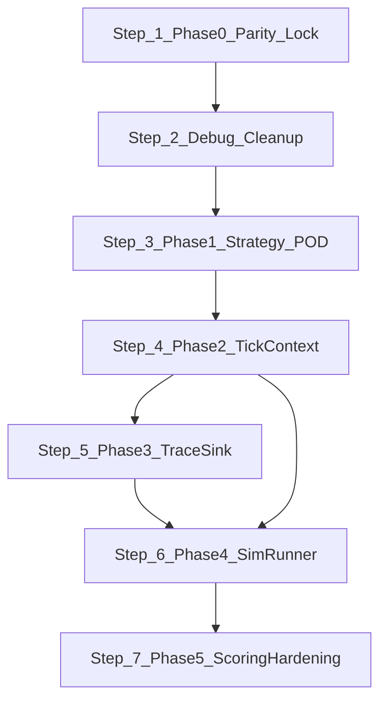

# Repo State & Suggested Next Steps

## Current State

**Parity**: ~11 of 22 golden fixtures still failing. Failures are in ranged-vs-melee duels (e.g. `duel_mage_vs_guardian`) and 4 multi-unit scenarios that cascade from the same positional errors.

**Uncommitted changes** (3 files):
- [`native/src/teamfight_simulation_core.cpp`](native/src/teamfight_simulation_core.cpp): float64 migration, targeting improvements, debug instrumentation (+179/-161 vs base)
- [`scripts/simulation/headless_runner.gd`](scripts/simulation/headless_runner.gd): relaxed pass condition — signature mismatch no longer blocks if payload matches within tolerance
- [`fixtures/goldens/match_fixtures.json`](fixtures/goldens/match_fixtures.json): no diff from base

**Known technical debt in the hot loop:**
- 26 `UtilityFunctions::print` calls scattered through the hot loop (gated behind `_debug_fixture_name` string guards, plus unconditional `[duel]`/`[duel-pos]` prints for 2-unit matches)
- 103 `Dictionary.get("…")` calls for strategy and stats lookups (Relic #1)
- Dead `_process_actions()` function (~80 lines, duplicates `_update_unit` action logic, never called by `_step_tick`)

**Not yet started:** `sim_runner.gd` (Phase 4)

---

## Step 1 — Complete Phase 0: Parity Lock

**This is the prerequisite for everything else.**

The `[duel-pos]` per-tick position trace was built into the DLL in the last session but the run was interrupted before output was captured. The root cause of the ~0.44-unit positional gap between native and Python guardians at t=51.8 in `duel_mage_vs_guardian` is still unconfirmed.

**Concrete actions:**
- Run `duel_mage_vs_guardian` with the current instrumented DLL; capture and compare `[duel-pos]` output against the Python `debug_mage_duel.py` trace to find the first diverging tick
- The most likely candidates for the divergence are:
  - Mage kiting direction after respawn (native kite vector vs Python kite vector when near the `WORLD_BOUNDARY_MIN` corner)
  - Guardian's accumulated position before mage death (minor float differences prior to t=40.4 compound over the dead phase)
  - The `_kite_from_enemies` repulsion direction using `alive` enemies only — verify the guardian appears in the danger radius scan at the correct tick
- Fix the identified root cause in [`native/src/teamfight_simulation_core.cpp`](native/src/teamfight_simulation_core.cpp)
- Rerun full fixture suite; confirm all 22 pass

---

## Step 2 — Clean Up Debug Artifacts (immediate post-parity)

Before starting any refactor phase, remove all temporary instrumentation to prevent hot-loop overhead and restore readability.

**Files to clean:**
- [`native/src/teamfight_simulation_core.cpp`](native/src/teamfight_simulation_core.cpp):
  - Remove `[duel-pos]` per-tick position print block added to `_step_tick` (lines ~2259–2275)
  - Remove `[duel] AUTO` print in `_perform_auto_attack` and `[duel] CAST` print in `_start_cast`
  - Remove all `[native-debug] PREACT`, `MOVE`, `KITE` prints gated behind `_debug_fixture_name == "backline_skirmish"`
  - Delete the dead `_process_actions()` function (~lines 2415–2540)
- [`Python/debug_mage_duel.py`](Python/debug_mage_duel.py): delete (temporary diagnostic only)
- Confirm `native_duel_output.txt` at repo root is either gitignored or deleted

---

## Step 3 — Phase 1: Typed `UnitStrategy` POD Struct

**Highest ROI, zero behavior risk.**

Replace the `Dictionary strategy` pattern (103 `.get("…")` calls in the hot loop) with a typed C++ POD struct. All scoring, selection, and movement code currently does repeated `Variant` casts per-call.

**Key files:** [`native/src/teamfight_simulation_core.hpp`](native/src/teamfight_simulation_core.hpp), [`native/src/teamfight_simulation_core.cpp`](native/src/teamfight_simulation_core.cpp)

**Steps:**
- Define `struct UnitStrategy` in the header with all ~22 knobs as `double`/`bool` fields, `std::array<StringName, 8> bucket_order`, and two `std::unordered_map<StringName, double>` for role priorities
- Add `std::unordered_map<StringName, UnitStrategy> _role_strategy_cache` to `TeamfightSimulationCore`
- Rewrite `_strategy_for_unit()` to populate the cache once at match init (`_populate_runtime_state`) and return `const UnitStrategy&`
- Update all call sites: `_score_enemy_target`, `_score_ally_target`, `_select_enemy_target`, `_select_ally_target`, `_should_switch`, `_kite_from_enemies`, `_update_unit`
- Rerun fixture suite — no scores should change

---

## Step 4 — Phase 2: `TickContext` Struct

**Required before batch-scale optimization.**

`last_density_count` currently lives on `UnitState` and is populated in `_refresh_target_pressure()`. Team center and backline list scans happen inline inside every scoring call.

**Steps:**
- Define `struct TickContext` in the header: `std::vector<int64_t> density_counts`, `Vector2 player_team_center`, `Vector2 enemy_team_center`, `std::vector<int64_t> player_backliners`, `std::vector<int64_t> enemy_backliners`
- Add `_build_tick_context() -> TickContext` called once at top of `_step_tick()`
- Remove `last_density_count` from `UnitState`
- Pass `const TickContext&` into `_score_enemy_target`, `_select_enemy_target`, `_refresh_target_pressure`
- Rerun fixture suite — scores may shift slightly if density timing was previously off; treat deltas as a new parity target against Python

---

## Step 5 — Phase 3: Structured Trace Sink

**Prerequisite for clean batch runs.**

Currently 26+ `UtilityFunctions::print` calls are mixed into hot logic with hardcoded fixture-name guards:
```2455:2455:native/src/teamfight_simulation_core.cpp
if (_debug_combat_trace && (unit.instance_id == 5 || unit.instance_id == 2) && _debug_fixture_name == String("backline_skirmish") && _time >= 3.8 && _time <= 4.8) {
```

**Steps:**
- Define `struct TraceEvent { double t; StringName kind; int64_t src; int64_t tgt; double val; }` in the header
- Add `std::vector<TraceEvent> _trace_buffer` (pre-allocated, 4096 slots) to `TeamfightSimulationCore`
- Add `_emit_trace(kind, src, tgt, val)` — appends to buffer only when `_debug_combat_trace` is set; no fixture-name branching inside the method
- Replace all inline print calls with `_emit_trace(…)` calls
- Flush buffer in `_build_summary()` or on demand
- Remove `_debug_fixture_name` field and all string comparisons in the hot loop

---

## Step 6 — Phase 4: `SimRunner` Adapter

**Needed before Godot gameplay integration.**

**Steps:**
- Create [`scripts/simulation/sim_runner.gd`](scripts/simulation/sim_runner.gd) as a thin GDScript wrapper around `TeamfightSimulationCore`
- Expose `step(delta: float)` that accumulates `delta` and fires `step_tick()` N times at the fixed rate
- Expose `get_trace_events() -> Array` reading the Phase 3 trace buffer as typed Godot Dictionaries
- Update [`scripts/simulation/headless_runner.gd`](scripts/simulation/headless_runner.gd) and [`scripts/simulation/native_simulation_backend.gd`](scripts/simulation/native_simulation_backend.gd) to delegate through `SimRunner`
- Keep `_step_tick` internal to the extension

---

## Step 7 — Phase 5: Scoring Hardening (deferred)

**Intentionally behavior-altering; gate on extended fixture stability.**

After Phases 1–4 are complete and the fixture suite has been stable for multiple runs:
- Identify scoring terms in `_score_enemy_target` that can be expressed as fixed-point or integer bins
- Replace continuous heuristics one at a time; update golden fixtures to reflect each intentional behavioral change
- Each change is a deliberate delta — do not batch multiple changes into one fixture regeneration

---

## Execution Order


