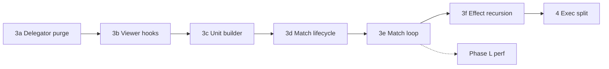

# Simulation Refactor — Iteration 3 Plan

Continuation of the native coordinator slim-down after Iteration 2 exit closure (May 2026). Goal: keep `TeamfightSimulationCore` as Godot glue and match orchestration only; move remaining gameplay logic into `native/src/simulation/`.

**Baseline (start of Iteration 3):**

| Metric | Value |
|--------|-------|
| `teamfight_simulation_core.cpp` | ~3,827 lines |
| `teamfight_simulation_core.hpp` | 489 lines |
| `SimExecCallbacks` | 1 field (`debug_combat_trace`) |
| `sim_host_*` friends | 9 |
| Fixtures | 7/7 green |
| Release bench (5v5, 2k, workers=1) | 100.57 m/s (May 24 baseline 106.68 m/s) |

**Iteration 3 exit targets:**

| Metric | Target |
|--------|--------|
| `teamfight_simulation_core.cpp` | < 2,500 |
| `teamfight_simulation_core.hpp` private methods | < 40 |
| `sim_host_*` friends | ≤ 3 (or single host table in `.cpp`) |
| No private method that only forwards to `sim::*` without side effects | Enforced |
| Fixtures | 7/7 green |
| Bench | Documented; regain 106+ m/s optional (Phase L only) |

**Iteration 3 completed (May 28, 2026):**

| Phase | Status |
|-------|--------|
| 3a Delegator purge | Done |
| 3b Viewer hooks | Done |
| 3c Unit builder + roster | Done |
| 3d Match lifecycle | Done |
| 3e Match loop | Done |
| 3f Effect recursion | Done (`sim_effects_host` trampoline) |
| 4 Exec split | Done |
| L Performance | Documented (110.71 m/s; spatial index deferred) |

**Actual exit:** `teamfight_simulation_core.cpp` **~2830** (header < 2500 stretch goal); friends **7**; fixtures **7/7**; bench **110.71 m/s**.

---

## Principles

1. **One behavioral change per PR** where possible; structural moves only unless fixing a bug.
2. **Do not edit** `scripts/simulation/champion_catalog.gd` for refactor work.
3. **Do not run** `native/src/tools/archive/` migration scripts.
4. **`SimWorld` lvalue rule:** delegators that call modules must pass `sim::SimWorld w = _sim_world();` (never pass a temporary).
5. **Hot/cold lockstep:** `_unit_cold` stays paired with `_units`; use `_uc(u)` only when `u` is an element inside `_units`.
6. **Perf vs structure:** Phases 3a–3f and 4 are structural; Phase L is perf-only. Never mix in one PR.
7. **Validation gate** (every phase): see [Validation gate](#validation-gate) below.

---

## Validation gate

Run after each phase (in order):

```powershell
cmake --build native/build --config Release
.\run_godot.ps1 -- --check-only
.\run_godot.ps1 -- --check-native-load
.\run_godot.ps1 -- --check-match-telemetry
.\run_godot.ps1 -- --fixture-file=res://fixtures/goldens/match_fixtures.json
.\run_godot.ps1 -- --check-benchmark --batch-count=2000 --team-size=5 --bench-skip-summaries --workers=1
```

Before long Godot runs: `--check-only` on all edited GDScript (none expected for native-only phases).

After any Godot run: confirm no hung Godot processes.

**Bench policy:** Record `matches/sec` and `duration_sec` in `wiki/notes/performance_optimization_status.md`. Structural phases should stay within ±2% of the branch baseline unless Phase L explicitly changes hot paths.

**Fixture policy:** If summaries drift without intentional balance change, use `--rewrite-fixture-summaries` only after confirming parity diagnosis (not as a default).

---

## Phase overview

| Phase | Name | Est. cpp Δ | Risk | Suggested PR |
|-------|------|------------|------|--------------|
| 3a | Delegator purge | −600–900 | Low | PR 1 |
| 3b | Viewer hooks | −200–350 | Low–med | PR 2 |
| 3c | Unit builder / roster | −450–500 | Med | PR 3 |
| 3d | Match lifecycle | −200–250 | Med | PR 4 |
| 3e | Match loop extract | −100–150 | Med | PR 5 |
| 3f | Flatten effect recursion | Small (design) | High | PR 6 (optional) |
| 4 | Split `sim_effects_exec` | Organize | Med | PR 7+ |
| L | Performance closure | Bench | Med | Separate PRs |



Phase L may start in parallel after 3e if profiling is needed before 3f; do not land perf and structural changes in the same commit.

---

## Phase 3a — Delegator purge

**Objective:** Remove private `TeamfightSimulationCore::_*` methods that only forward to `sim::*` and are not referenced from coordinator code or host friends.

### Steps

1. **Inventory** all `TeamfightSimulationCore::_*` definitions in `teamfight_simulation_core.cpp` (~100 methods).
2. **Classify** each as:
   - **Delete:** pure forwarder, zero in-coordinator callers.
   - **Keep:** adds viewer FX, targeting sync, profiling, Godot API, or implements `sim_host_*` friend.
   - **Keep temporarily:** called only from other coordinator methods slated for 3b–3d (mark with comment `// iter3: move in 3b`).
3. **Remove** Delete methods from `.cpp` and `.hpp` in one pass (or damage/status/periodic batches).
4. **Verify** no references remain (`rg '_apply_damage\\(' native/src` etc.).
5. **Trim header** private section: target < 60 declarations after 3a (final < 40 after 3d).

### Do not delete yet

- `_heal_unit`, `_add_shield`, `_apply_aoe_*_shape` (viewer side effects → 3b).
- `_handle_death`, `_respawn_unit`, `_build_unit_state`, `_append_team_units`, `_process_pending_spawns` (→ 3c/3d).
- `_execute_effect`, `sim_host_*` bodies (→ 3f / 3b).
- `_simulate`, `_step_tick`, `_update_unit`, `_update_projectiles` (→ 3e).

### Acceptance

- [ ] cpp line count ≤ ~2,900
- [ ] Full validation gate green
- [ ] No new `sim_host_*` friends

### Docs

- Note line-count delta in `wiki/notes/performance_optimization_status.md` (structural only).

---

## Phase 3b — Viewer hooks

**Objective:** Move visualization side effects out of coordinator wrappers into simulation modules via an explicit hook struct; shrink `CombatHostHooks` and coordinator AOE-shape duplicates.

### New types (suggested: `sim_viewer.hpp`)

```cpp
namespace sim {
struct ViewerHooks {
    void *user_data = nullptr;
    void (*record_damage_fx)(...) = nullptr;
    void (*record_heal_fx)(...) = nullptr;
    void (*record_shield_fx)(...) = nullptr;
    void (*record_hot_status_fx)(...) = nullptr;
    void (*record_aoe_shape_fx)(...) = nullptr;
    void (*record_passive_aoe_fx)(...) = nullptr;
};
}
```

Optional: fold into `SimHostCallbacks` instead of a separate struct if that reduces parameter churn.

### Steps

1. Add `ViewerHooks` and coordinator factory `TeamfightSimulationCore::_viewer_hooks()` that captures `this` and forwards to existing `_viewer_*` implementations (can remain in coordinator `.cpp` initially).
2. **Extend** `sim::status::heal_unit`, `add_shield`, and shape application paths in `sim_status` / `sim_periodic` to accept optional `const ViewerHooks *` (nullptr = no FX, preserves headless bench).
3. **Remove** coordinator wrappers that only did `sim::status::…` + `_viewer_record_*` (e.g. `_heal_unit`, `_add_shield`, `_apply_aoe_*_shape` FX prefix pattern).
4. **Wire** `CombatHostHooks.heal_unit`:
   - Either remove override and call `status::heal_unit(world, …, viewer_hooks)` everywhere, or make `sim_host_heal_unit` a thin call into `status::heal_unit` with hooks (no `TeamfightSimulationCore::_heal_unit`).
5. **Migrate** `SimHostCallbacks::viewer_record_damage_fx` / `viewer_record_hot_status_fx` to `ViewerHooks` if duplicated.
6. **Drop friends** where bodies become unnecessary:
   - Target remove: `sim_host_viewer_record_damage_fx`, `sim_host_heal_unit` (if combat uses module path only).
   - Keep until 3f: `sim_host_execute_effect`, `sim_host_handle_death`, targeting sync friends if still needed.

### Files

| File | Change |
|------|--------|
| `sim_viewer.hpp` (new) | Hook struct + inline no-ops |
| `sim_status.cpp` / `.hpp` | Optional viewer on heal/shield |
| `sim_periodic.cpp` / `.hpp` | Optional viewer on AOE shapes |
| `sim_combat.cpp` | Pass viewer hooks instead of `CombatHostHooks.heal_unit` where possible |
| `teamfight_simulation_core.cpp` | Bind hooks once in `_bind_sim_host`; delete duplicate shape wrappers |

### Acceptance

- [ ] Viewer FX still appear in simulation viewer / `get_tick_snapshot` parity
- [ ] `sim_host_*` friends ≤ 6
- [ ] Full validation gate green
- [ ] Bench within ±2%

### Docs

- Update `wiki/notes/simulation_module_map.md` with `sim_viewer` / `ViewerHooks`.

---

## Phase 3c — Unit builder and roster

**Objective:** Extract `_build_unit_state`, `_append_team_units`, and `_process_pending_spawns` into `sim_unit_builder` + `sim_match_roster` (names flexible).

### New module: `sim_unit_builder`

**Owns:**

- Champion vs minion catalog resolution
- Passive effect compilation into `UnitStateCold` buckets
- Role config overlays, reflect passive finalization
- Initial stats / cooldowns / spawn positions (non-respawn)

**API sketch:**

```cpp
namespace sim::unit_builder {
struct BuildInput {
    const catalog::CatalogState &catalog;
    const Dictionary &spawn_spec;
    StringName team;
    int64_t instance_id;
};
struct BuildResult {
    UnitState unit;
    UnitStateCold cold;
    bool ok;
};
BuildResult build_unit(const BuildInput &in, const catalog::CatalogHooks &hooks);
}
```

### New module: `sim_match_roster`

**Owns:**

- Push unit into `SimWorld` vectors + `_unit_index_map` + alive indices + targeting frame push
- Passive AOE viewer events at spawn (via `ViewerHooks` from 3b)
- Pending spawn drain (mirror current `_process_pending_spawns` semantics)

**Coordinator retains:**

- `_populate_runtime_state` orchestration (seed, tick_rate, flags, calls roster)
- Godot `Array` / `Dictionary` coercion (`_coerce_match_input`)

### Steps

1. Move `_build_unit_state` body to `sim_unit_builder.cpp` (~490 lines); pass catalog + effective champion cache accessors via `CatalogHooks` / `SimWorld`.
2. Move `_append_team_units` loop to `sim_match_roster::append_team_units(SimWorld &, ViewerHooks *, …)`.
3. Move `_process_pending_spawns` to `sim_match_roster::process_pending_spawns` using `SimMatchHost` fields already on exec path.
4. Add sources to `native/CMakeLists.txt`.
5. Delete coordinator methods; call modules from `_populate_runtime_state` and `_step_tick`.

### Acceptance

- [ ] cpp ≤ ~2,400
- [ ] 7/7 fixtures green
- [ ] Native load + telemetry checks pass
- [ ] Minion mid-match spawn cases unchanged (pending spawn + targeting frame push)

### Docs

- `simulation_module_map.md`: `sim_unit_builder`, `sim_match_roster`.

---

## Phase 3d — Match lifecycle

**Objective:** Extract `_handle_death` and `_respawn_unit` into `sim_match_lifecycle`.

### New types

```cpp
namespace sim::match {
struct MatchScoreState {
    int *player_kills;
    int *enemy_kills;
    TickContext *tick_ctx;
    double time;
};
void handle_death(SimWorld &, SimHostCallbacks &, ViewerHooks *,
    MatchScoreState &, UnitState &killer, UnitState &target);
void respawn_unit(SimWorld &, SimHostCallbacks &, ViewerHooks *,
    MatchScoreState &, UnitState &unit, SpawnSlotState &slots);
}
```

`SpawnSlotState` holds assign/release slot helpers currently on coordinator.

### Steps

1. Move death scoring, assists, takedown effect dispatch, periodic clear, spawn slot release/assign.
2. Replace `sim_host_handle_death` body with call to `match::handle_death` (friend may remain as one-line trampoline until 3f).
3. Move respawn reset block (~90 lines) + spawn position logic.
4. Ensure `sim::stats_modifiers::clear_all_stat_modifiers` stays on respawn path.

### Acceptance

- [ ] Kill/assist/respawn fixture behavior unchanged
- [ ] `sim_host_*` friends ≤ 4
- [ ] Full validation gate green

### Docs

- `simulation_module_map.md`: `sim_match_lifecycle`.

---

## Phase 3e — Match loop extract

**Objective:** Move `_simulate` and `_step_tick` into `sim_match_loop` (or extend `sim_match`).

### API sketch

```cpp
namespace sim::match {
struct MatchLoopState {
    SimWorld world;
    SimHostCallbacks host;
    // tick, time, projectiles ref, profiling counters ref, ...
};
void step_tick(MatchLoopState &, bool profile_sim);
void simulate(MatchLoopState &, double match_duration);
}
```

### Steps

1. Extract tick driver: projectile update → pending spawns → prepare_tick_context → unit updates.
2. Keep sudden-death / max_ticks logic with `_simulate`.
3. Coordinator `run_match` becomes: populate → `match::simulate` → `_build_summary`.
4. Optional micro-opt: construct **one** `SimWorld` per `step_tick` and pass by reference into unit/projectile updates (document in perf note if bench improves).

### Acceptance

- [ ] cpp < 2,500 (primary exit metric)
- [ ] Full validation gate green
- [ ] Bench within ±2%

### Docs

- `simulation_module_map.md`: `sim_match_loop` or expanded `sim_match`.

---

## Phase 3f — Flatten effect recursion (optional / high risk)

**Objective:** Remove `SimHostCallbacks::execute_effect` → coordinator → exec indirection for nested effects.

### Options (pick one in implementation PR)

**A — Direct exec call:** `execute_effect` function pointer initialized to a static trampoline in `sim_effects_host.cpp` that calls `sim::effects::execution::execute` without touching `TeamfightSimulationCore`.

**B — Closure on host:** Store `std::function` or plain C callback with `SimMatchHost` + `SimExecCallbacks` captured at match start (avoid `std::function` on hot path if bench regresses).

### Steps

1. Implement chosen option in `sim_effects_exec` / host bind only.
2. Remove `TeamfightSimulationCore::_execute_effect` if unused.
3. Remove `sim_host_execute_effect` friend.
4. Deep recursion / stack parity: run full fixtures + spot-check nested passives (Yuumi-style, on_kill chains).

### Acceptance

- [ ] 7/7 fixtures green
- [ ] `sim_host_*` friends ≤ 2
- [ ] Bench within ±2%; if regression >2%, profile before revert

### When to skip

If schedule-constrained, defer 3f until after Phase 4; Iteration 3 structural exit can still be declared after 3e.

---

## Phase 4 — Split `sim_effects_exec` (organizational)

**Objective:** Reduce `sim_effects_exec.cpp` (~1,632 lines) without behavior change.

### Suggested split

| File | Opcodes |
|------|---------|
| `sim_effects_exec.cpp` | Core dispatcher + `execute()` |
| `sim_effects_exec_damage.cpp` | Damage / modifier / attack routing |
| `sim_effects_exec_status.cpp` | CC, heal, shield, stat stacks |
| `sim_effects_exec_spawn.cpp` | Spawn, minion, projectile push |
| `sim_effects_exec_aoe.cpp` | AoE shapes, periodic apply |

### Steps

1. One category per PR; shared helpers in `sim_effects_exec.hpp` or `sim_effects_exec_internal.hpp`.
2. No opcode logic changes in split PRs.
3. Validation gate per split.

### Acceptance

- [ ] No fixture drift
- [ ] Each new .cpp added to `CMakeLists.txt`

---

## Phase L — Performance closure (separate track)

**Not required for Iteration 3 structural exit.** Run only after 3e (or in parallel once match loop is stable).

| Item | When | Gate |
|------|------|------|
| Profile with `TEAMFIGHT_SIM_PROFILE=1` | First | Identify top buckets |
| Projectile spatial index | If collision hot | Fixtures + bench ±2% |
| Reuse `SimWorld` per tick | If delegator churn remains | Bench only |
| `EffectExecStore` / alloc reduction | If alloc hot | Bench + fixtures |
| Targeting score cache | Last resort | Bench + targeting fixtures |

**Target:** Document path to ≥106 m/s; do not block Iteration 3 merge on reaching it.

---

## CMake additions (cumulative)

Add to `TEAMFIGHT_SIMULATION_SOURCES` as modules land:

```
src/simulation/sim_unit_builder.cpp      # 3c
src/simulation/sim_match_roster.cpp      # 3c (or merge with sim_match_spawn)
src/simulation/sim_match_lifecycle.cpp   # 3d
src/simulation/sim_match_loop.cpp        # 3e
# sim_effects_exec_*.cpp                 # Phase 4
```

---

## Documentation checklist (end of Iteration 3)

- [ ] `wiki/notes/simulation_module_map.md` — all new modules
- [ ] `wiki/notes/performance_optimization_status.md` — bench after each phase
- [ ] `wiki/projects/simulation_refactor_iteration_3.md` — mark phases complete
- [ ] Optional `wiki/notes/simulation_refactor_tick_exit.md` — friend/callback inventory

---

## Out of scope

- Rebalancing or editing `champion_catalog.gd`
- GDScript simulation parity changes
- Python reference port
- Archive migration scripts under `native/src/tools/archive/`
- Editing Cursor plan files in agent transcripts (this wiki doc is the source of truth)

---

## Suggested execution order for agents

1. Read this doc + `wiki/notes/simulation_module_map.md`.
2. Implement **one phase per PR**; run validation gate before next phase.
3. Mark todos: `phase-3a-delegator-purge`, `phase-3b-viewer-hooks`, etc.
4. Do not combine 3a+3b in a single commit (reviewability).

**First PR:** Phase 3a only.
